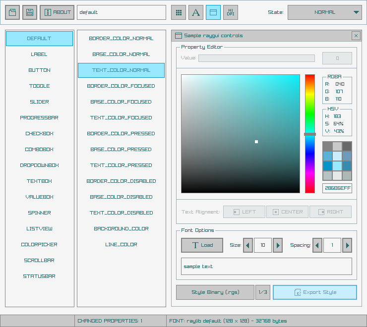

# rGuiStyler

A simple and easy-to-use [raygui](https://github.com/raysan5/raygui) styles editor.

Useful for tools style customization. The best tool companion for [rGuiLayout](https://raylibtech.itch.io/rguilayout) and [rGuiIcons](https://raylibtech.itch.io/rguiicons).

rGuiStyler can be used for free as a [WebAssembly online tool](https://raylibtech.itch.io/rfxgen) and it can also be downloaded as a **standalone tool** for _Windows_ and _Linux_ with some extra features.

 

_NOTE: This tool is itended to be used with [**raygui 3.1**](https://github.com/raysan5/raygui)_

## rGuiStyler Features

 - **Global and control specific styles edition**
 - **Style preview** in real time with individual test controls
 - Selectable controls state: **NORMAL, FOCUSED, PRESSED, DISABLED**
 - Save and load style custom format: `.rgs` (binary)
 - Export style as an embeddable **code file** (`.h`)
 - Export style as a controls **table image** (`.png`)
 - Import, configure and preview **style fonts** (`.ttf`/`.otf`)
 - Color palette for quick color save/selection
 - **8 custom style examples** included
 
### rGuiStyler Standalone Additional Features

 - Command-line support for `.rgs`/`.h`/`.png` batch conversion
 - Command-line support for `.rgs` plain text file export
 - **Completely portable (single-file, no-dependencies)**

## rGuiStyler Screenshot

 
## rGuiStyler Usage

The tool is quite intuitive, the expected steps to follow are: 
 1. Choose the control to edit from first ListView (`DEFAULT` referes to global style for all controls)
 2. Choose the property to edit from second ListView
 3. Select a value for that property (color, number...)
 
NOTE: Changes are previewed in real time in the same tool! 

Once the desired style has been created, press the `Export Style` button to save it as a `.rgs`**binary style file**. Style can also be exported as an embeddable `.h` **code file** or a `.png` **controls table image** (intended for preview and style showcase)

`rGuiStyler Standalone` comes with command-line support for batch conversion and audio playing. For usage help:

 > rguistyler.exe --help

## rGuiStyler License

`rGuiStyler` online tool can be used completely for free.

`rGuiStyler Standalone` desktop tool is distributed as freeware. In any case, consider some donation to help the author keep working on software for games development.

*Copyright (c) 2015-2021 raylib technologies ([@raylibtech](https://twitter.com/raylibtech))*
